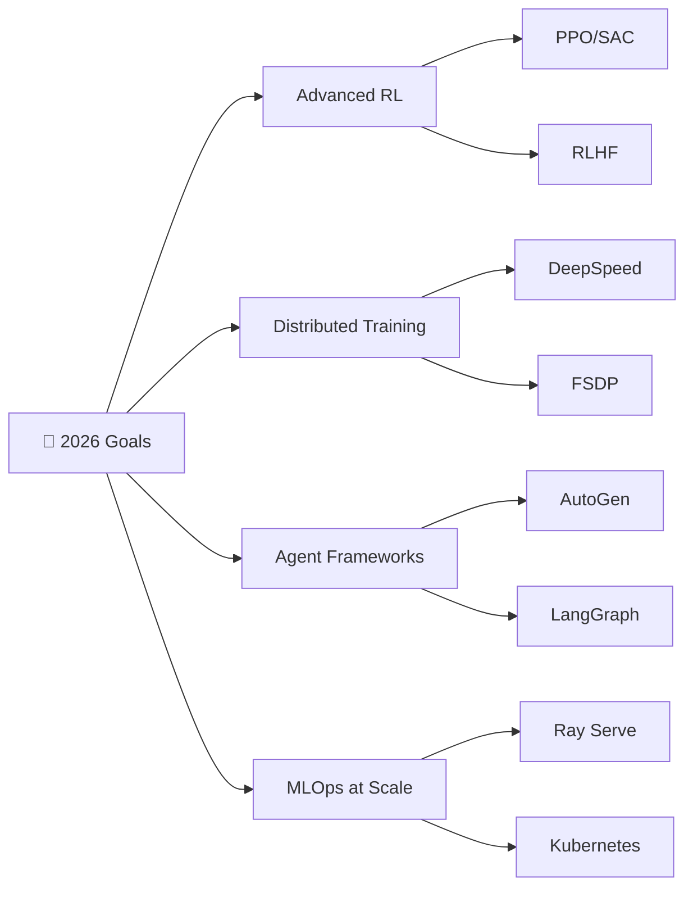

# 👋 Hello, I'm Gaurvi Vishnoi

<div align="center">
  
  [](https://git.io/typing-svg)
  
  
  
</div>

---

## About Me

Machine Learning Engineer focused on building scalable, production-grade AI systems across language, vision, and multi-agent environments. I work across the full stack from model design and evaluation to deployment and real-time infrastructure using tools like PyTorch, JAX, LLM orchestration frameworks, and cloud-native systems.

I’m particularly interested in efficient model serving, retrieval-augmented systems, and robust evaluation strategies that make AI reliable at scale. I value clean system design, low-latency architectures, and translating complex ideas into practical, high-impact solutions.

Always learning exploring new advances in foundation models, distributed systems, and MLOps to stay at the edge of what’s possible in applied AI.

---

## Professional Experience

<details open>
<summary><b>Machine Learning Engineer Intern @ Autodesk</b> | San Francisco, CA | <i>May 2025 - Aug 2025</i></summary>
<br>

- Built an **LLM-as-a-Judge evaluation framework** for Salesforce CRM AI summaries with multi-model weighted consensus scoring
- Engineered end-to-end **MLOps pipeline** with fault-tolerant orchestration, reducing manual QA by **60%** across thousands of CRM records
- Deployed real-time **Streamlit dashboard on AWS Lambda** with CI/CD pipeline for production-scale AI-generated insights
- Implemented parallelized inference with auto-retry logic measuring accuracy, hallucination, bias, and value at scale

</details>

<details>
<summary><b>Graduate Research Assistant @ USC NEXDIG Lab</b> | Los Angeles, CA | <i>Oct 2024 - Mar 2026</i></summary>
<br>

- Developed a state-aware multi-agent system (D2I) for end-to-end actionable data-to-insight discovery using LLM-driven reasoning and structured analytical workflows
- Designed a trajectory-based exploration framework with persistent memory (Insight Repository) enabling iterative, context-aware, and non-redundant insight generation
- Introduced an adversarial multi-agent validation framework (advocate–skeptic–judge) to ensure statistical robustness and filter low-quality insights
- Preparing submission for top-tier database conference (VLDB Demo Track 2025)

</details>

<details>
<summary><b>Machine Learning Intern @ Coforge</b> | Greater Noida, India | <i>Oct 2023 - Jan 2024</i></summary>
<br>

- Architected **LLM-driven document extraction pipeline** using Azure Cognitive Services achieving **95% field-level accuracy**
- Enhanced OCR robustness with **OpenCV and TensorFlow**, reducing inference latency by **15%** through model quantization
- Spearheaded **LLM-driven metadata extraction** and schema generation with parallel validation workflows for production AI system
- Validated against manual ground-truth annotations across thousands of semi-structured insurance documents

</details>

---

## Research & Publications

### Published Works

**[Full Page Handwriting Recognition on CUDA Enabled Docker](https://example.com)**  
*Journal of Artificial Intelligence and Imaging* • October 2024  
🔹 Built a multiline handwriting recognition pipeline by combining TrOCR with PaddleOCR 
🔹 Optimized inference with GPU acceleration and parallel processing
🔹 Designed efficient pipeline for batch processing handwritten documents

**[Dense Caption Imaging](https://zenodo.org/records/8394992)**  
*International Journal of Scientific Research and Technology* • September 2023  
🔹 Developed a hierarchical text-to-image generation system (StackGAN-based) for caption-conditioned image synthesis 
🔹 Trained on COCO and CUB datasets, optimizing for semantic consistency and diversity in generated images
🔹 Enhanced generation quality using attention mechanisms, residual connections, and advanced upsampling (Laplacian pyramid) for improved structure and detail

### Current Research Projects

**D2I: Data-to-Insight Multi-Agent Pipeline**
- Architected a stateful multi-agent system for automated, end-to-end data-to-insight discovery
- Designed an adversarial validation framework (advocate–skeptic–judge) for robust insight verification
- Built trajectory-based memory, skill-driven planning for iterative, context-aware analysis
- Leveraging LLM orchestration, semantic retrieval, and hybrid execution SQL/Python for scalable analytics

---

## Technical Expertise

### AI & Machine Learning

<table>
<tr>
<td width="50%" valign="top">

**Large Language Models**
- Fine-tuning: QLoRA, LoRA, PEFT, RLHF
- Frameworks: LangChain, CrewAI, AutoGen
- Evaluation: LLM-as-a-Judge, RAG systems
- Models: GPT-4, Claude, LLaMA, Mistral

**Computer Vision**
- Object Detection: YOLO, DETR, DINO
- Segmentation: SAM, Mask R-CNN
- Vision Transformers: ViT, CLIP, BLIP
- 3D Vision: Depth estimation, Point clouds

</td>
<td width="50%" valign="top">

**GenAI & Multimodal AI**
- Text-to-Image: Stable Diffusion, SDXL
- Video Generation: CogVideoX, Wav2Lip
- Vision-Language: CLIP, BLIP, LLaVA
- Multi-Agent Systems: Debate, Reflection

**MLOps & Deployment**
- Cloud: AWS (Lambda, SageMaker), GCP, Azure
- Containerization: Docker, Kubernetes
- Experiment Tracking: MLFlow, W&B
- Optimization: CUDA, TensorRT, ONNX

</td>
</tr>
</table>

### Tech Stack

```yaml
Languages:
  Primary: [Python, C++, JavaScript, SQL]
  Secondary: [R, HTML, CSS, CUDA]

ML Frameworks:
  Deep Learning: [PyTorch, TensorFlow, JAX, Keras]
  Traditional ML: [Scikit-learn, XGBoost, LightGBM]
  NLP: [HuggingFace Transformers, SpaCy, NLTK]
  Computer Vision: [OpenCV, Torchvision, Albumentations]
  
LLM & Agent Frameworks:
  Orchestration: [LangChain, LlamaIndex, CrewAI]
  Serving: [vLLM, TGI, Ollama]
  Evaluation: [DeepEval, RAGAS, LangSmith]

Data & Databases:
  Processing: [Pandas, NumPy, PySpark]
  Databases: [PostgreSQL, MongoDB, ChromaDB, Pinecone]
  Visualization: [Matplotlib, Seaborn, Plotly, Streamlit]

DevOps & Tools:
  Cloud: [AWS, GCP, Azure]
  Containers: [Docker, Kubernetes]
  Workflow: [Airflow, MLflow]
  Version Control: [Git, DVC]
```

---

## Achievements & Recognition

| Award | Achievement | Year |
|-------|-------------|------|
| **Certificate of Merit** | 1st Rank in B.Tech 3rd Year (CSE - AI/ML), SRM University | 2023 |
| **Certificate of Appreciation** | 3rd Prize at SRM Tech Expo (500+ participants) | 2024 |
| **Merit Scholarship** | Performance-based scholarship by CSE Dept, SRM | 2021 |
| **Dean's List** | Consistent academic excellence (GPA > 9.7/10) | 2020-2024 |

---

## Featured Projects

### [YouTube Real-Time Transcription & Translation Extension](https://github.com/gaurvi-vishnoi)
> Chrome MV3 extension with real-time ASR and live translation
- **Tech**: TypeScript, Node.js, WebSocket, OpenAI Realtime API
- **Highlights**: Web Audio Worklet, 24kHz PCM16 resampling, sub-second latency captions
- **Features**: Rolling caption overlay, English/Hindi translation, decoupled service worker pipeline

### [JAX-Based LLM Routing System](https://github.com/gaurvi-vishnoi)
> AI customer support routing with RAG pipeline and confidence-based guardrails
- **Tech**: Python, JAX, Flax, OpenAI API, Streamlit
- **Highlights**: LLM-as-a-Judge evaluation, grounded responses, performance analytics dashboard
- **Impact**: Automated ticket classification with real-time monitoring

### [D2I: Data-to-Insight Pipeline](https://github.com/gaurvi-vishnoi)
> Multi-agent system for automated insight generation from structured data
- **Tech**: LangChain, GPT-4o, PostgreSQL, Python
- **Highlights**: Advocate-skeptic-judge debate validation, dynamic skill generation
- **Impact**: 60% reduction in data analysis time, 40% improvement in insight quality

---

## GitHub Analytics

<div align="center">
  
  
  
  
</div>

<div align="center">
  
  
</div>

---

## Latest Blog Posts & Articles

<!-- BLOG-POST-LIST:START -->
- [The Rise of Mixture of Experts: How MoE is Reshaping AI in 2026](https://medium.com/@gaurvi.i.vishnoi/the-rise-of-mixture-of-experts-how-moe-is-reshaping-ai-in-2026-45a47bfa4dfc)
- [Swimming Robots Smaller Than a Grain of Sand: A Tiny Revolution](https://medium.com/@gaurvi.i.vishnoi/swimming-robots-smaller-than-a-grain-of-sand-a-tiny-revolution-with-massive-potential-0100354bd880)
- [From Words to Worlds: My Journey into Vision-Language-Action Systems](https://medium.com/@gaurvi.i.vishnoi/from-words-to-worlds-my-journey-into-vision-language-and-vision-language-action-systems-b79b4b3ee8d6)
- [How Sakana AI's Evolutionary Algorithm Builds Powerful AI Models](https://medium.com/@gaurvi.i.vishnoi/how-sakana-ais-new-evolutionary-algorithm-builds-powerful-ai-models-without-expensive-retraining-7bc7f2545a5c)
<!-- BLOG-POST-LIST:END -->

---

## Current Learning Goals



-  **Advanced RL**: Implementing PPO, SAC, and RLHF for LLM alignment
-  **Distributed Training**: Mastering DeepSpeed, FSDP for large-scale model training
-  **Agent Frameworks**: Deep dive into AutoGen, LangGraph for complex workflows
-  **MLOps at Scale**: Production deployment with Ray Serve, Kubernetes Orchestration

---

## Open to Collaborate On

- **Research**: Multi-Agent Systems, Large Language Models, Vision-Language Models
- **Open Source**: Machine Learning Tools, Agent Frameworks, Evaluation Pipelines
- **Industry Projects**: Generative AI Applications, MLOps Infrastructure
- **Mentorship**: Machine Learning Internships, Research Opportunities, Career Guidance

---

## Let's Connect!

<div align="center">

[](https://www.linkedin.com/in/gaurvi-vishnoi/)
[](https://github.com/gaurvi-vishnoi)
[](mailto:gaurvi.i.vishnoi@gmail.com)
[](https://medium.com/@gaurvi.i.vishnoi)

</div>

---

<div align="center">
  
  ### 💭 Philosophy
  
  **"Research sharpens ideas. Design shapes the experience. Code turns vision into reality."**
  
  ---
  
  From [gaurvi-vishnoi](https://github.com/gaurvi-vishnoi) | Last updated: April 2026
  
</div>
