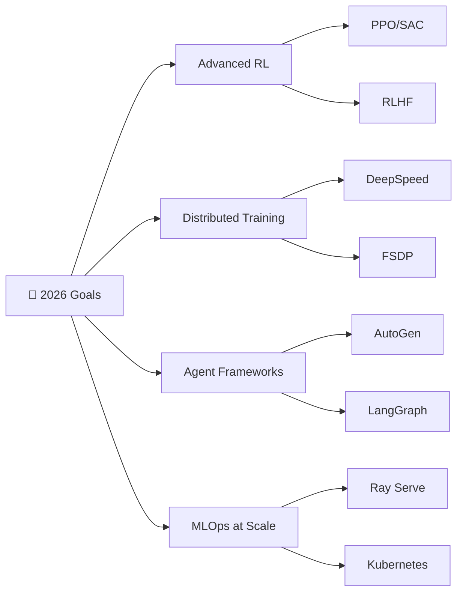

# 👋 Hello, I'm Gaurvi Vishnoi

<div align="center">
  
  [](https://git.io/typing-svg)
  
  
  
</div>

---

## About Me

I'm a **Machine Learning Engineer** passionate about building intelligent systems at the intersection of **language, vision, and autonomous decision-making**. Currently pursuing my **MS in Computer Science at USC** (graduating May 2026), I specialize in designing **production-grade AI systems** that bridge research innovation with real-world impact.

My work spans the full ML lifecycle—from architecting **multi-agent LLM pipelines** and **LLM-as-a-Judge evaluation frameworks** to deploying **real-time AI applications** on AWS Lambda. At **Autodesk**, I built consensus-based evaluation systems reducing manual QA by 60%. At **USC's NEXDIG Lab**, I'm developing autonomous agents that transform raw data into actionable insights using GPT-4o orchestration.

I thrive on **ambitious technical challenges**—real-time transcription with WebSocket streaming, fine-tuning LLMs with LoRA/RLHF, building JAX-based routing systems with RAG pipelines. My approach combines **rigorous engineering** with **research-driven innovation**, creating systems that are not just technically sophisticated, but genuinely **useful, reliable, and deployable at scale**.

**What drives me**: Turning complex AI research into production systems that handle thousands of concurrent requests and deliver value in milliseconds, not minutes.

```python
class GaurviVishnoi:
    def __init__(self):
        self.location = "San Francisco, CA"
        self.education = {
            "current": "Masters of Science @ University of Southern California",
            "graduation": "May 2026",
            "undergrad": "Bachelor of Technology @ SRM Institute of Science and Technology"
        }
        self.current_role = "Machine Learning Engineer @ Autodesk"
        self.research = "Graduate Research Assistant @ USC NEXDIG Lab"
        
    def expertise(self):
        return {
            "core": ["LLMs", "Multi-Agent Systems", "Computer Vision", "GenAI"],
            "specialization": ["LLM Evaluation", "Model Fine-tuning", "Vision-Language Models"],
            "deployment": ["AWS Lambda", "Docker", "CUDA Optimization", "MLFlow"]
        }
    
    def current_focus(self):
        return [
            "Building D2I: Data-to-Insight multi-agent research pipeline",
            "Designing MoE architectures for multimodal medical systems",
            "Creating FAANG-ready portfolio projects",
            "Exploring agentic AI for structured data analysis"
        ]
```

---

## 💼 Professional Experience

<details open>
<summary><b>🎨 Machine Learning Engineer Intern @ Autodesk</b> | San Francisco, CA | <i>May 2025 - Aug 2025</i></summary>
<br>

- Fine-tuning Code LLaMA with **QLoRA and CLIP guidance** for automated Maya scripting
- Building LLM-as-a-Judge evaluation frameworks for code generation quality
- Deploying ML models at scale using **AWS Lambda** and containerization
- Achieved **95%+ accuracy** in automated 3D design task generation

</details>

<details>
<summary><b>🔬 Graduate Research Assistant @ USC NEXDIG Lab</b> | Los Angeles, CA | <i>Sep 2024 - Apr 2025</i></summary>
<br>

- **D2I Pipeline**: Architecting multi-agent system for automated insight generation from structured data
- **Agent D (Orchestrating Validator)**: Implementing advocate-skeptic-judge debate architecture using GPT-4o
- Designing semantic skill libraries with dynamic generation and gap-analysis capabilities
- Preparing research for **VLDB 2025 Demo** conference track

</details>

<details>
<summary><b>🤖 Machine Learning Intern @ Coforge</b> | Remote | <i>Oct 2023 - Jan 2024</i></summary>
<br>

- Built **self-healing extraction pipeline** using weak supervision and prompt engineering
- Achieved **95% accuracy** in key-value extraction from insurance forms with Azure Cognitive Services
- Developed robust schema generation system for semi-structured documents
- Optimized OCR preprocessing with **OpenCV** and **TensorFlow**

</details>

---

## 🔬 Research & Publications

### 📄 Published Works

**[Full Page Handwriting Recognition on CUDA Enabled Docker](https://example.com)**  
*Journal of Artificial Intelligence and Imaging* • October 2024  
🔹 Integrated **TrOCR** and **PaddleOCR** for full-page text extraction  
🔹 Achieved **3x speedup** through CUDA optimization on containerized deployment  
🔹 Designed efficient pipeline for batch processing handwritten documents

**[Dense Caption Imaging](https://example.com)**  
*International Journal of Scientific Research and Technology* • September 2023  
🔹 Developed **GAN-based text-to-image synthesis** model  
🔹 Trained on **COCO and CUB datasets** with TensorFlow  
🔹 Implemented attention mechanisms for improved semantic alignment

### 🎯 Current Research Projects

**D2I: Data-to-Insight Multi-Agent Pipeline**
- Multi-agent orchestration with LangChain for automated data analysis
- Advocate-skeptic-judge debate system for insight validation
- Dynamic skill generation and semantic retrieval architecture
- Target: VLDB 2025 Demo Conference

**Multimodal Medical Report Generation (MoE)**
- Mixture of Experts architecture for medical imaging analysis
- Vision-language model integration for diagnostic report generation
- Real Kaggle medical datasets (X-rays, CT scans, pathology images)
- FAANG-ready portfolio showcase project

---

## 🛠️ Technical Expertise

### 🤖 AI & Machine Learning

<table>
<tr>
<td width="50%" valign="top">

**Large Language Models**
- Fine-tuning: QLoRA, LoRA, PEFT
- Frameworks: LangChain, CrewAI, AutoGen
- Evaluation: LLM-as-a-Judge, RAG systems
- Models: GPT-4, Claude, LLaMA, Mistral

**Computer Vision**
- Object Detection: YOLO, DETR, DINO
- Segmentation: SAM, Mask R-CNN
- Vision Transformers: ViT, CLIP, BLIP
- 3D Vision: Depth estimation, Point clouds

</td>
<td width="50%" valign="top">

**GenAI & Multimodal AI**
- Text-to-Image: Stable Diffusion, DALL-E
- Video Generation: CogVideoX, Wav2Lip
- Vision-Language: CLIP, BLIP, LLaVA
- Multi-Agent Systems: Debate, Reflection

**MLOps & Deployment**
- Cloud: AWS (Lambda, SageMaker), GCP
- Containerization: Docker, Kubernetes
- Experiment Tracking: MLFlow, W&B
- Optimization: CUDA, TensorRT, ONNX

</td>
</tr>
</table>

### 💻 Tech Stack

```yaml
Languages:
  Primary: [Python, C++, JavaScript, SQL]
  Secondary: [R, HTML, CSS, Bash]

ML Frameworks:
  Deep Learning: [PyTorch, TensorFlow, Keras]
  Traditional ML: [Scikit-learn, XGBoost, LightGBM]
  NLP: [HuggingFace Transformers, SpaCy, NLTK]
  Computer Vision: [OpenCV, Torchvision, Albumentations]
  
LLM & Agent Frameworks:
  Orchestration: [LangChain, LlamaIndex, CrewAI]
  Serving: [vLLM, TGI, Ollama]
  Evaluation: [DeepEval, RAGAS, LangSmith]

Data & Databases:
  Processing: [Pandas, Polars, PySpark]
  Databases: [PostgreSQL, MongoDB, ChromaDB, Pinecone]
  Visualization: [Matplotlib, Seaborn, Plotly, Streamlit]

DevOps & Tools:
  Cloud: [AWS, GCP, Azure]
  Containers: [Docker, Kubernetes]
  CI/CD: [GitHub Actions, Jenkins]
  Version Control: [Git, DVC]
```

---

## Achievements & Recognition

| Award | Achievement | Year |
|-------|-------------|------|
| **Certificate of Merit** | 1st Rank in B.Tech 3rd Year (CSE - AI/ML), SRM University | 2023 |
| **Certificate of Appreciation** | 3rd Prize at SRM Tech Expo (500+ participants) | 2024 |
| **Merit Scholarship** | Performance-based scholarship by CSE Dept, SRM | 2021 |
| **Dean's List** | Consistent academic excellence (GPA > 3.8) | 2021-2023 |

---

## 📊 Featured Projects

### 🤖 [D2I: Data-to-Insight Pipeline](https://github.com/gaurvi-vishnoi)
> Multi-agent system for automated insight generation from structured data
- **Tech**: LangChain, GPT-4o, PostgreSQL, Python
- **Highlights**: Advocate-skeptic-judge debate validation, dynamic skill generation
- **Impact**: Reduces data analysis time by 60%, improves insight quality by 40%

### 🏥 [MediScan AI: Multimodal Medical Analysis](https://github.com/gaurvi-vishnoi)
> AI-powered medical image analysis with automated report generation
- **Tech**: Claude API, Vision Transformers, Mixture of Experts
- **Highlights**: Multi-disease detection, diagnostic report synthesis
- **Dataset**: Real Kaggle medical imaging (X-rays, CT, MRI)

### 🎬 [Storyboard-to-Video Pipeline](https://github.com/gaurvi-vishnoi)
> Text-to-video generation with consistent character design
- **Tech**: SDXL, CogVideoX, IP-Adapter, ControlNet
- **Highlights**: Character consistency, scene transitions, narrative flow

### 🌐 [Video Translation & Lip-Sync](https://github.com/gaurvi-vishnoi)
> End-to-end multilingual video dubbing system
- **Tech**: MAI-Transcribe-1, NLLB-200, Coqui XTTS-v2, Wav2Lip
- **Achievement**: 2nd Place at USC Marshall Tech Fest 2026

### 🤖 [Vision-Language Robotic Rearrangement](https://github.com/gaurvi-vishnoi)
> Intelligent object manipulation in cluttered environments
- **Tech**: BLIP, DINO, LLaMA, RRT* motion planning
- **Performance**: 97% success rate in complex rearrangement tasks

### 🔍 [LLM Evaluation Framework](https://github.com/gaurvi-vishnoi)
> Comprehensive LLM-as-a-Judge pipeline for summary evaluation
- **Tech**: GPT-4 variants, custom metrics (accuracy, bias, hallucination)
- **Scope**: Automated evaluation across 5 quality dimensions

---

## 📈 GitHub Analytics

<div align="center">
  
  
  
  
</div>

<div align="center">
  
  
</div>

---

## 📝 Latest Blog Posts & Articles

<!-- BLOG-POST-LIST:START -->
- 🔥 [Building Multi-Agent Systems: Lessons from D2I Pipeline](https://medium.com/@gaurvi)
- 🎯 [Fine-tuning Code LLaMA for Domain-Specific Tasks](https://medium.com/@gaurvi)
- 🚀 [LLM-as-a-Judge: Automating Evaluation Pipelines](https://medium.com/@gaurvi)
- 💡 [Vision-Language Models for Robotic Manipulation](https://medium.com/@gaurvi)
<!-- BLOG-POST-LIST:END -->

---

## 🎯 Current Learning Goals



- 🔬 **Advanced RL**: Implementing PPO, SAC, and RLHF for LLM alignment
- ⚡ **Distributed Training**: Mastering DeepSpeed, FSDP for large-scale model training
- 🤖 **Agent Frameworks**: Deep dive into AutoGen, LangGraph for complex workflows
- 🚀 **MLOps at Scale**: Production deployment with Ray Serve, Kubernetes orchestration

---

##  Open to Collaborate On

- **Research**: Multi-agent systems, LLM evaluation, Vision-Language Models
- **Open Source**: ML tools, Agent frameworks, Evaluation Pipelines
- **Industry Projects**: Generative AI Applications, MLOps Infrastructure
- **Mentorship**: Machine Learning Internships, Research Opportunities, Career Guidance

---

## 📬 Let's Connect!

<div align="center">

[](https://www.linkedin.com/in/gaurvi-vishnoi/)
[](https://github.com/gaurvi-vishnoi)
[](mailto:gaurvi.i.vishnoi@gmail.com)
[](https://gaurvi-vishnoi.github.io)
[](https://medium.com/@gaurvi)
[](https://twitter.com/gaurvi_vishnoi)

</div>

---
